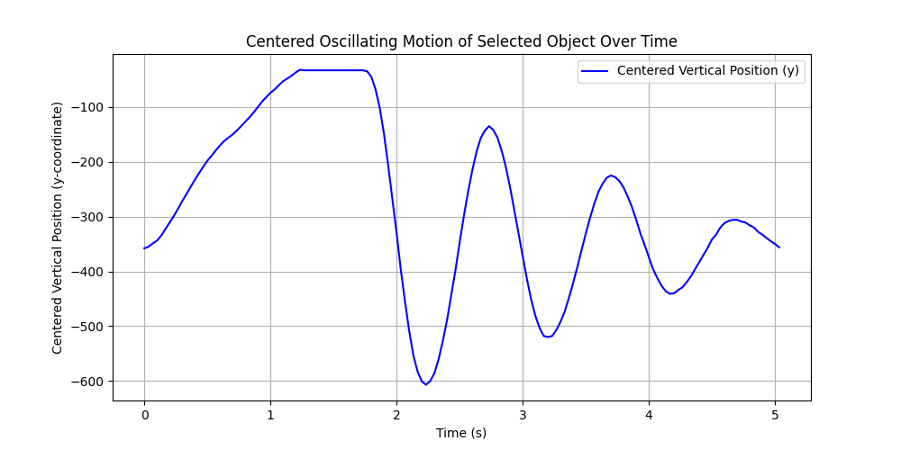
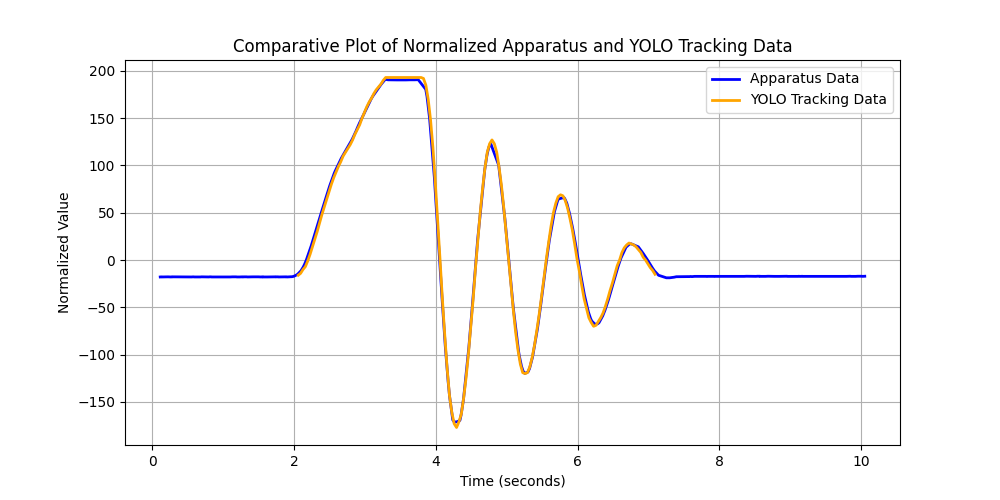

---

# Oscillation Tracker

## Overview

The **Oscillation Tracker** project leverages computer vision techniques to analyze oscillatory motion captured in videos. It uses a fine-tuned YOLO model to track a crash test sign and compares the extracted motion data with experimental apparatus measurements.
This project can be used to create synthetic data and then train finetune yolo to recognize any relatively simple objects. Just put raw images in the backgrounds dir and start the scripts one by one.

---

## Features

- **Video Normalization:** Crops and resizes videos based on the motion of a crash test sign for consistent analysis.
- **Object Tracking:** Tracks the motion of the crash test sign and logs its vertical oscillatory movement over time.
- **Data Comparison:** Visualizes and compares tracked motion against apparatus measurements.

---

## How It Works

1. **Preprocessing (`video_normalizer.py`):**
   - Scaled video to yolo standard size, crops the video to focus on the crash test sign and ensures its height is normalized across all frames.

2. **Object Tracking (`inference.py`):**
   - Uses YOLO to detect and track the crash test sign's motion.
   - Logs the y-coordinate of the crash test sign and visualizes its oscillation over time.

3. **Data Comparison (`compare.py`):**
   - Aligns and compares the motion captured by YOLO tracking with data from the experimental apparatus.
   - Provides a combined plot showing the correlation between the two data sources.

---

## Installation

### Prerequisites
- Python 3.10
- `pip` package manager

### Dependencies
Install the required libraries:
```bash
pip install -r requirements.txt
```

---

## Usage

### 1. Video Normalization
Normalize a video to crop and scale the crash test sign:
```bash
python video_normalizer.py input_video.mp4
```
**Output:** Cropped video saved in the `cropped_vid` directory and have a _cropped suffix.

### 2. Object Tracking
Track the crash test sign and visualize its oscillatory motion:
```bash
python inference.py cropped_vid/input_video_cropped.mp4
```
**Output:** A real-time display of the tracked object and a plot of its oscillatory motion.

The resulting oscillations mapped across time in our PoC:


### 3. Data Comparison
Compare the YOLO tracking data against apparatus measurements:
```bash
python compare.py normalized_video.mp4
```
**Input:** Apparatus data (`output_pos.csv`).

**Output:** A comparative plot showing the normalized oscillatory motion of the crash test sign and apparatus.

Data normalized on both ends to make a direct comparison:


---

## Output Details

1. **Cropped Video:**
   - Located in `cropped_vid/`.
   - Focuses on the crash test sign with consistent scaling across frames.

2. **Tracking Data:**
   - Motion plot generated by `inference.py` showing y-coordinate oscillations over time.

3. **Comparison Plot:**
   - Combined plot showing normalized YOLO and apparatus data side by side.

---
